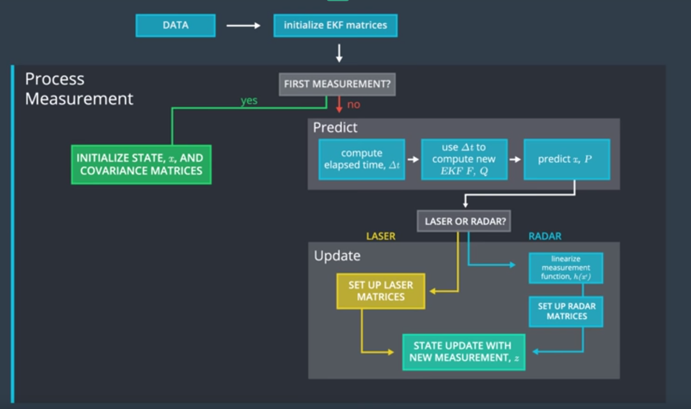
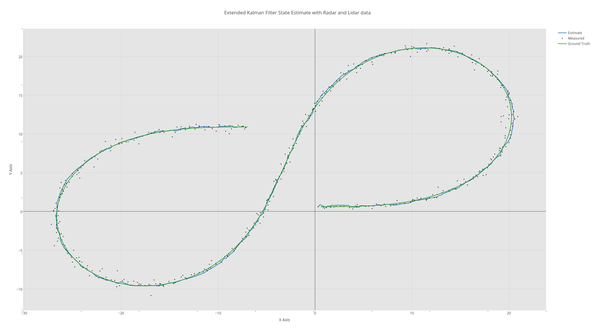
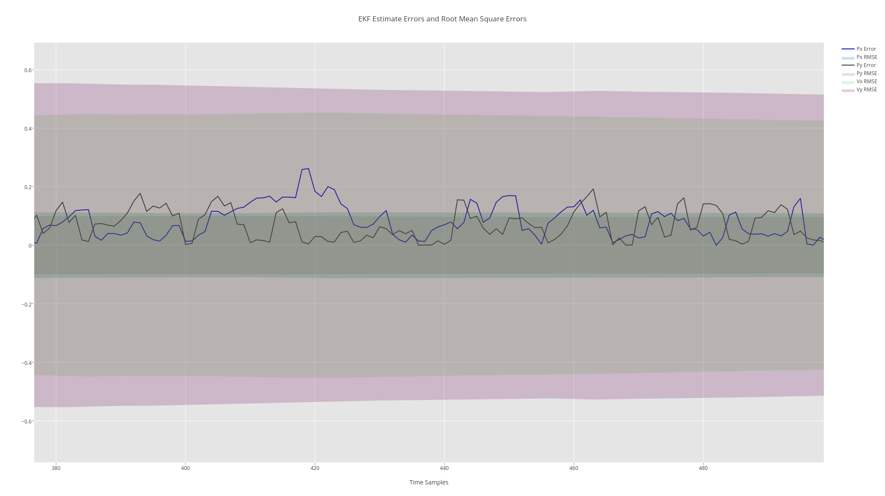

## CarND-Term2 Extended Kalman Filter
In this project we apply an Extended Kalman Filter to estimate the position and velocity of a moving vehicle in 2 dimensions. 

The sensor readings are composed of radar and lidar data, the radar measurements give us a nonlinear sensor model when estimating position and speed, while the lidar gives us a linear sensor estimate for position. 

The system model is assumed to be a linear cartesian speed and position model and the acceleration is lumped with the process noise. 

Based on which type of measurement is received, either a linear Kalman Filter is applied for a radar measurement or a nonlinear Extended Kalman Filter is for a lidar measurement.
 
 The below figure shows the measurement model as provided in the course material. 
 

The measurement noise covariance is fixed for both the lidar and radar, as specified by the sensor manuals. The process noise covariance is given a higher value, indicating less confidence in the process model.

The following figure shows the vehicle motion track, with the ground truth, the estimated position and the markers indicating the position measurements. 

And the following figure shows the position estimate error with the blue and black lines for the x and y positions respectively, and the shaded areas show the root mean square error for the four states. Not the figure is cropped to show only a final section of the time samples.

There are to main source files, main.cpp which is used with the simulator and main3.cpp which is used to process offline txt file data and output ekf estimates. 